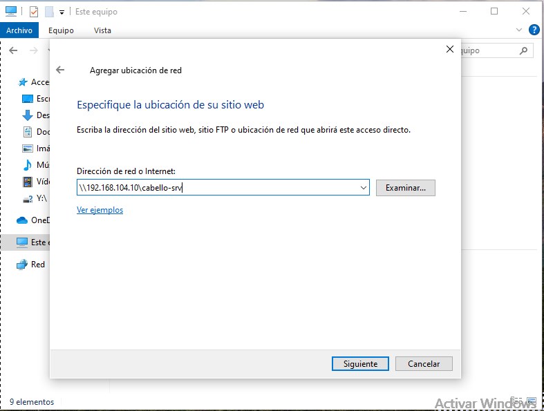

# Instalación y configuración de Samba desde Ubuntu Server
## Instalación de paquetes para Samba
En el servidor
```
sudo apt install samba
```

## Archivo /etc/samba/smb.conf
En el apartado \[global\]
```
bind interfaces only = yes
interfaces = lo ens19
smb ports = 445
```
Comprobación del archivo
```
testparm
```

## Creación de la carpeta compartida
```
sudo mkdir -p /samba/cabello-srv
```
Grupos de la carpeta
```
sudo chown :sambashare /samba/
sudo chown acabello:sambashare /samba/cabello-srv
```
Permisos de la carpeta
```
sudo chmod 2770 /samba/cabello-srv
```

## Creación del usuario de samba
Creación del usuario de Samba
```
sudo smbpasswd -a acabello
```
Habilitar el usuario de Samba
```
sudo smbpasswd -e acabello
```

## Archivo /etc/samba/smb.conf
Nuevo apartado \[carpeta-nueva\]
```
[cabello-srv]
  create mask = 0660
  directory mask = 2770
  path = /samba/carpeta-nueva
  read only = no
  browseable = yes
  writeable = yes
  valid users = acabello @sambashare
```
Comprobación del archivo
```
testparm
```

## Reinicio del servicio
```
sudo systemctl start smbd.service
```

## En el cliente Linux
Instalación de paquetes
```
sudo apt update
sudo apt install smbclient
```
Conexión con la carpeta compartida (también se puede gráficamente)
```
smbclient //192.168.101.10/cabello-srv -U acabello
```
Comandos para descargar/subir archivos
```
get archivo.txt
put archivo.txt
```

## En el cliente Windows
Añadir una ubicación de red

