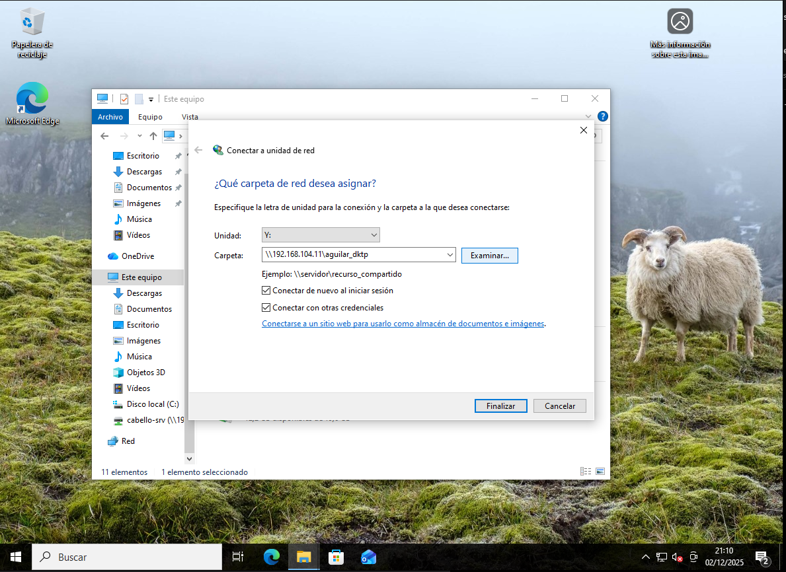

# Instalación y configuración de Samba desde Ubuntu Desktop
## Instalación de paquetes para Samba
En el servidor Samba se instala gráficamente

## Creación de usuario de Samba
```
sudo smbpasswd -a acabello
sudo smbpasswd -e acabello
```

## Creación de la carpeta y permisos
```
sudo mkdir -p /aguilar-dktp
sudo chown acabello:sambashare -R /aguilar-dktp
```

## Añadir al grupo sambashare
```
sudo usermod -aG sambashare acabello
```

## Reinicio del sistema
```
sudo reboot
```

## Compartición de la carpeta de Samba

Posteriormente añadimos los permisos automáticamente

## Conexión desde una máquina Linux
```
smbclient //192.168.104.11/aguilar-dktp
```

## Conexión desde una máquina Windows

