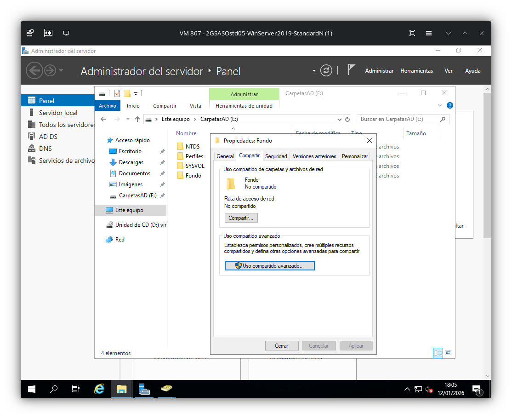
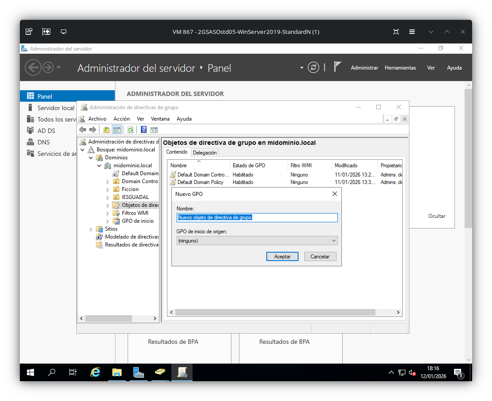
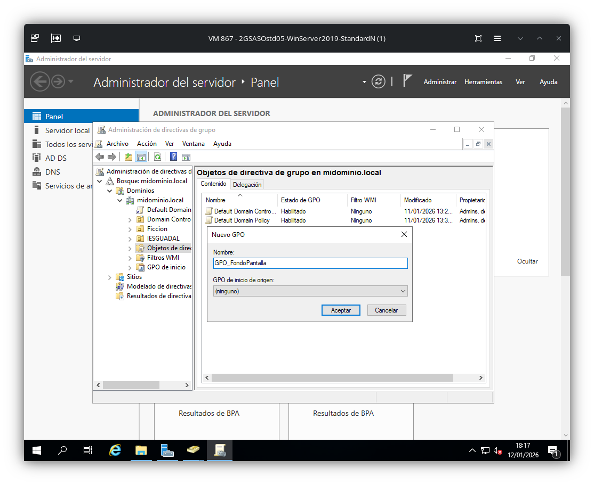
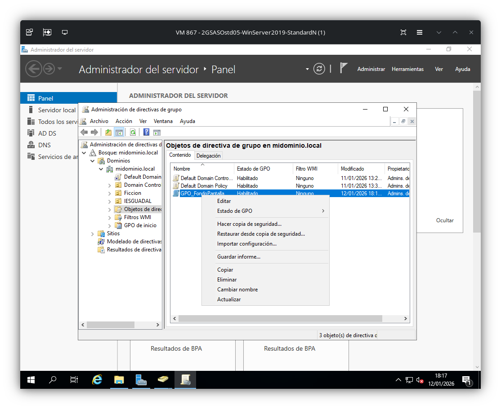
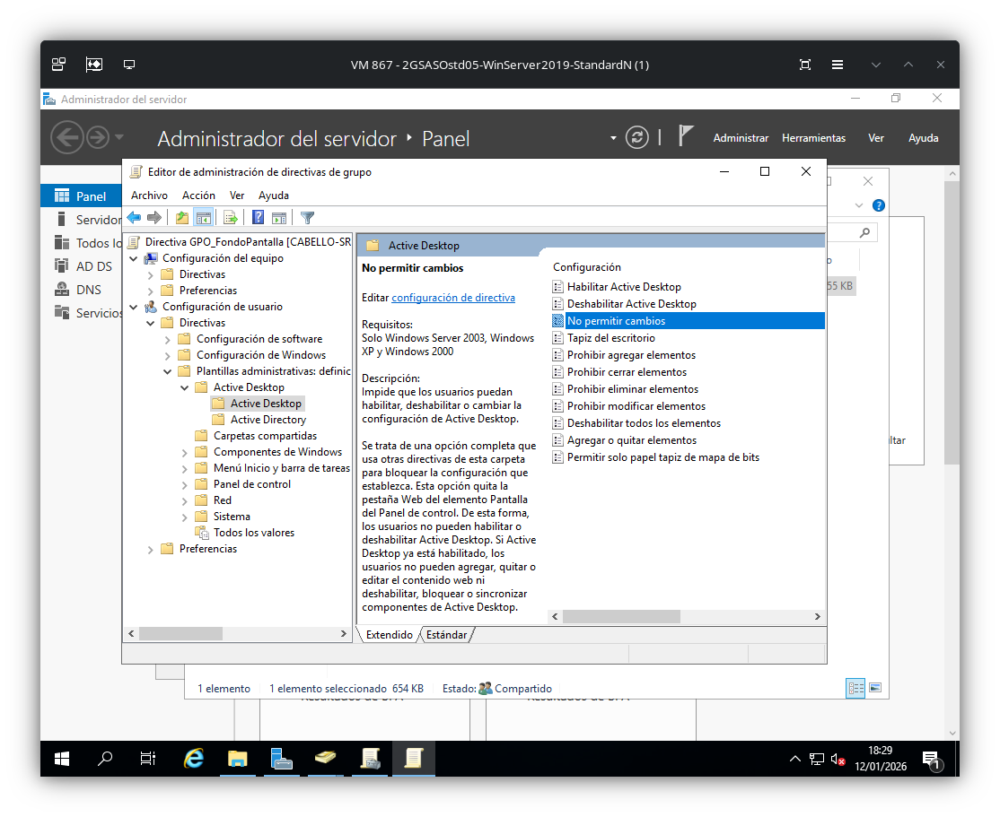
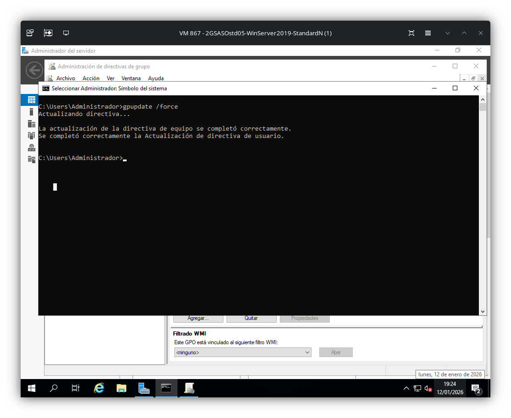

# Directivas de grupo

## Carpeta compartida
Para esta GPO es necesario antes un carpeta compartida donde se alojará el fondo de escritorio. Para ello, se creará una en E:\ 
Botón derecho > Compartir > Uso compartido avanzado

## Crear GPO
Herramientas > Administración de directivas de grupo > Bosque > Dominio > Objetos de directiva de grupo > Botón derecho > Nuevo

Una vez creada, se editará para seleccionar la GPO correspondiente al fondo de pantalla.
Configuración de usuario > Directivas > Plantillas administravias > Active Desktop > Active Desktop > Tapiz de escritorio

Como también se requiere que el usuario no pueda realizar cambios, se habilitará la GPO "No permitir cambios"

## Vincular GPO a Objeto
En este caso asignaremos la GPO a la unidad organizativa. Botón derecho > Vincular GPO existente...

A continuación, en el servidor, se ejecutará "gpupdate /force" para actualizar las GPOs

