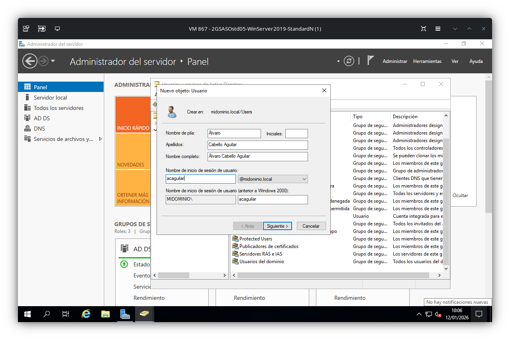
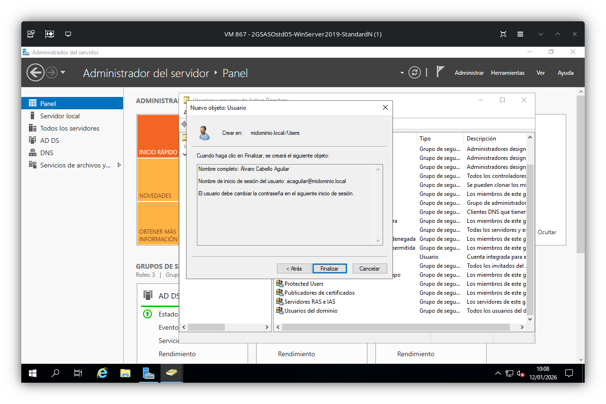
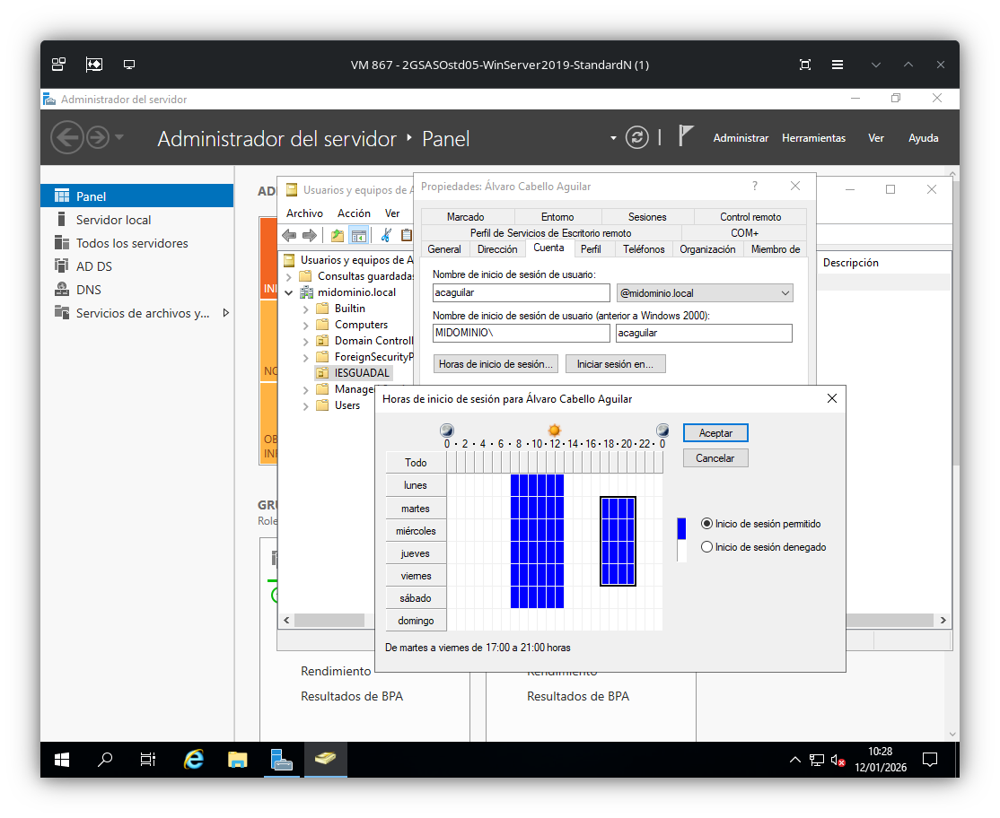
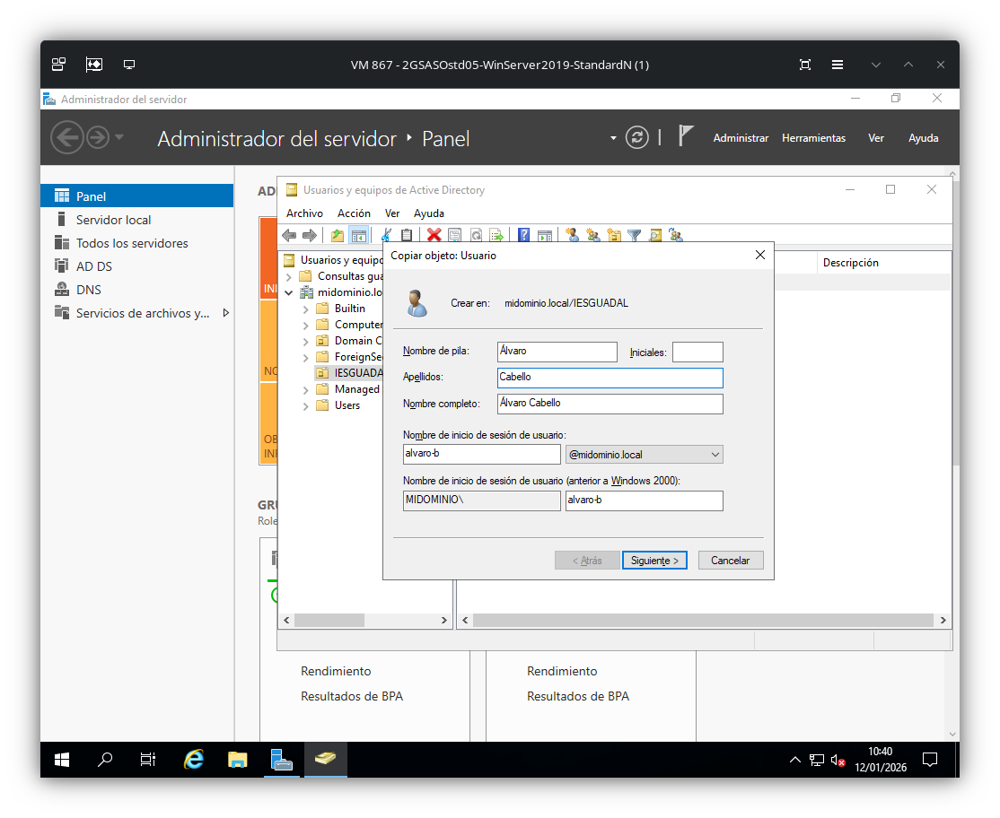
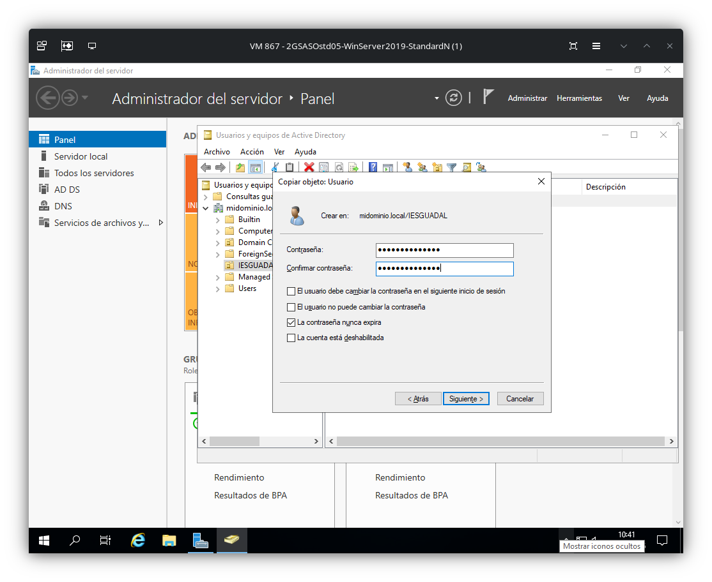
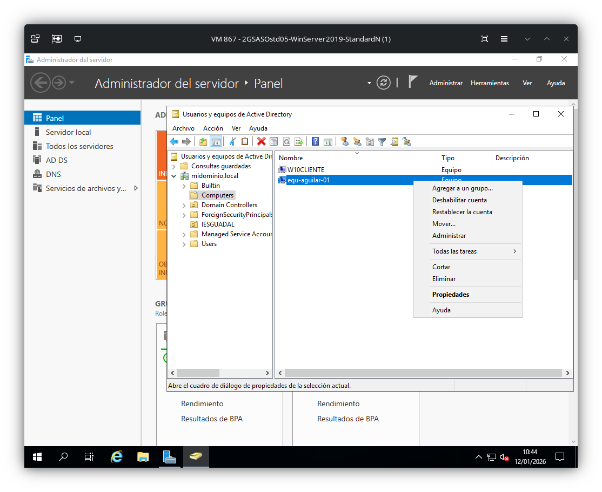
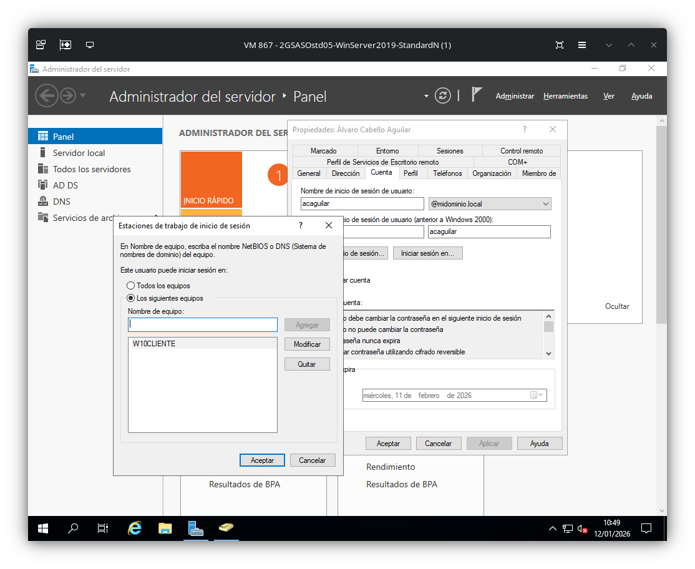

# Gestionar cuentas de usuario, de equipos, grupos y unidades organizativas

## Creación de un nuevo usuario
Para crear un nuevo usuario: Herramientas > Usuarios y equipos de Active Directory > Botón derecho > Nuevo > Usuario > Nombre > Contraseña

NOTA: Se puede mover un usuario ya creado con el botón derechero sobre él y "mover".

## Modificar un usuario
En las propiedades de una cuenta de usuario podemos realizar multitud de modificaciones:
- Opciones de contraseña

- Cambio de horario

- Miembro de un grupo

## Reestablecer la contraseña de un usuario
Para reestablecer la contraseña de un usuario: Seleccionamos el usuario > Acción > Reestablecer contraseña

## Crear copia de usuario
Botón derecho sobre el usuario > Copiar

## Crear un equipo y modificarlo
Dentro de "Computers" > Botón derecho > Nuevo > Equipo

## Restricciones de usuarios y equipos
Botón derecho sobre el usuario > Cuenta > Iniciar sesión en

## Crear un grupo y modificarlo
En Users (o donde se requiera) > Botón derecho > Nuevo > Grupo

Con el grupo seleccionado > Botón derecho > Propiedades

