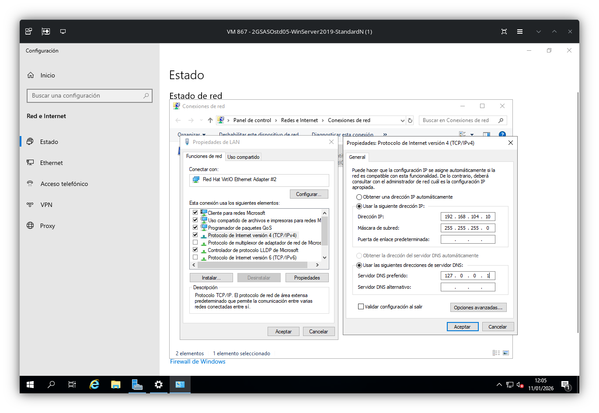

# Instalación y configuración de un dominio básico AD con Windows Server 2019

## Red LAN del servidor
Para la posterior unión del cliente al servidor se debe modificar el adaptador de red destinado a LAN.

## Cambio de nombre del servidor
A continuación, se muestra el cambio de nombre del servidor. Requiere de un reinicio posterior.

## Instalación del rol "Servicios de dominios de Active Directory"

### Contraseña DSRM:
WindowsServer2019!$

### Script 
#
# Script de Windows PowerShell para implementación de AD DS
#

Import-Module ADDSDeployment
Install-ADDSForest `
-CreateDnsDelegation:$false `
-DatabasePath "E:\NTDS" `
-DomainMode "WinThreshold" `
-DomainName "midominio.local" `
-DomainNetbiosName "MIDOMINIO" `
-ForestMode "WinThreshold" `
-InstallDns:$true `
-LogPath "E:\NTDS" `
-NoRebootOnCompletion:$false `
-SysvolPath "E:\SYSVOL" `
-Force:$true
