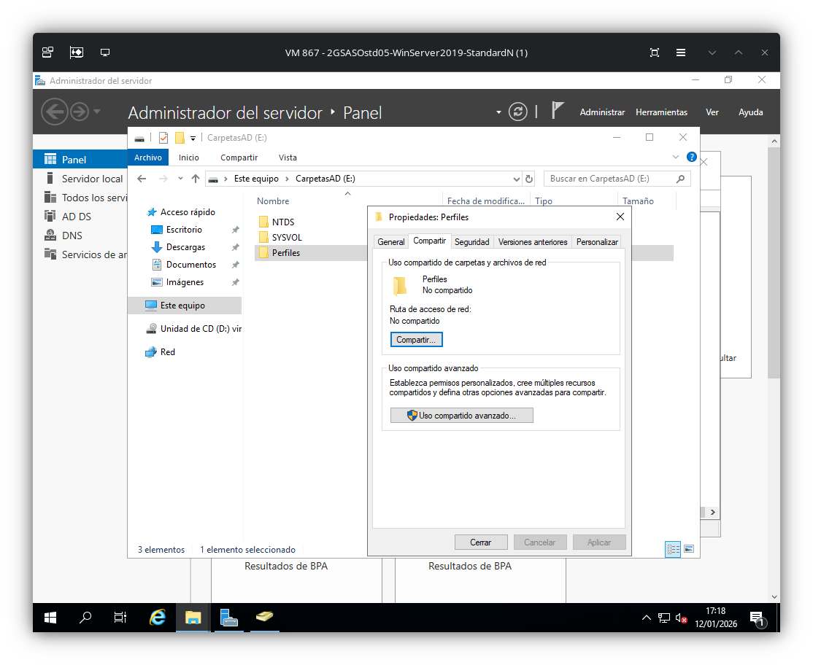
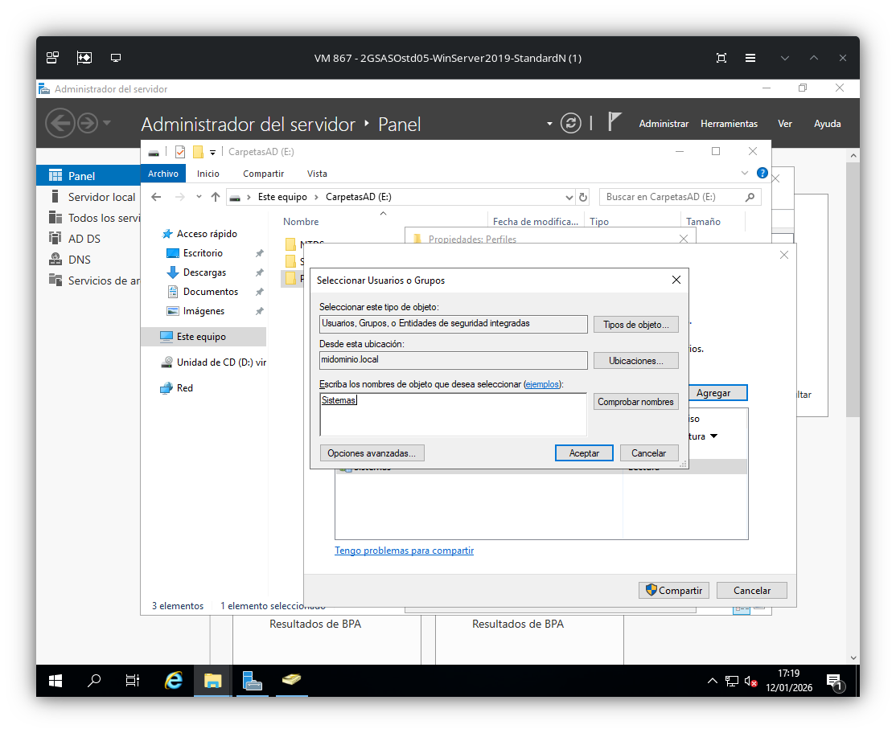
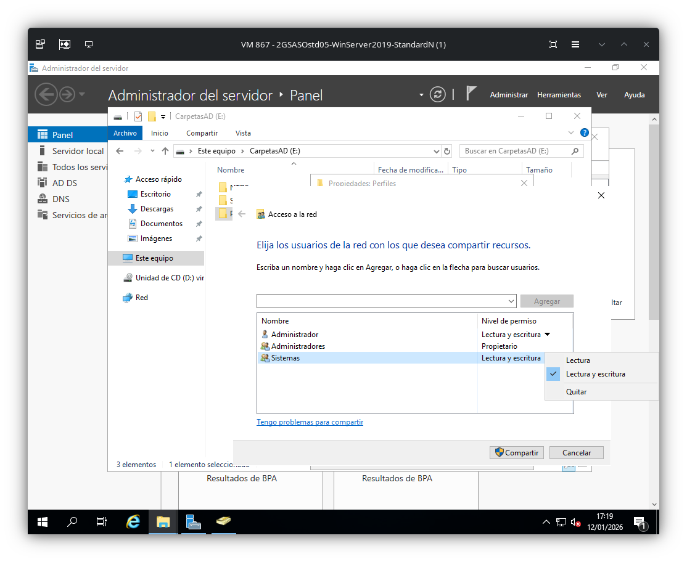
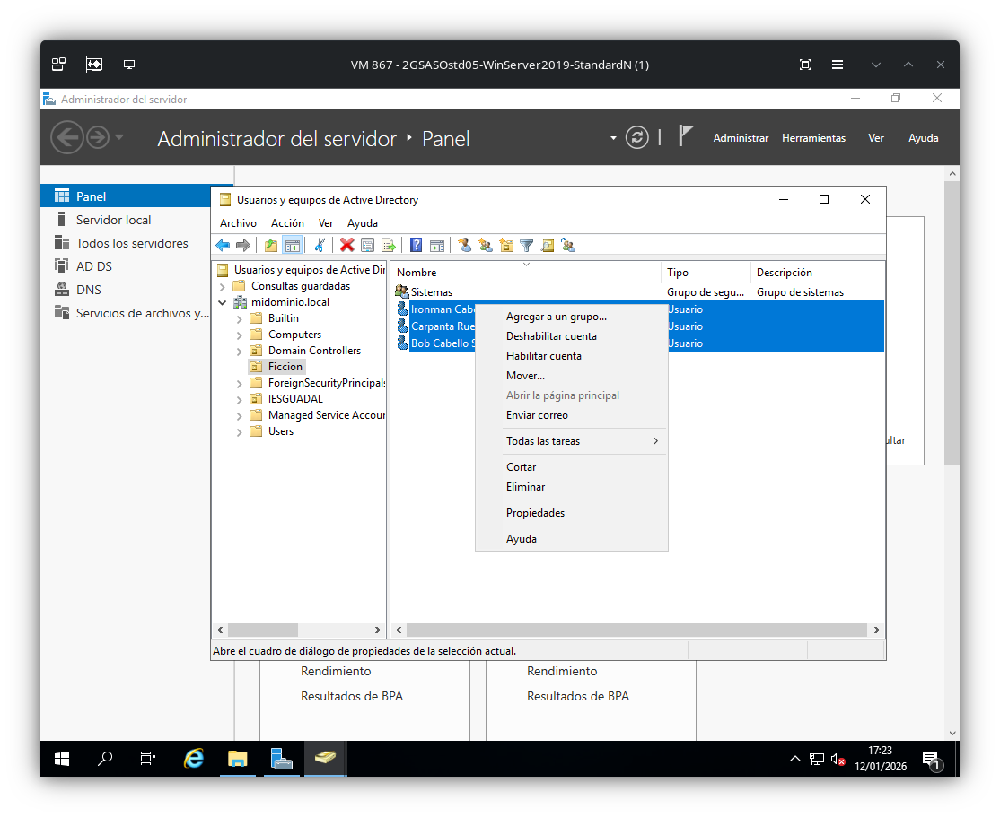
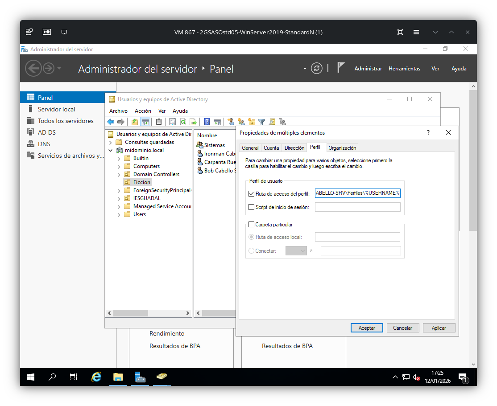

# Configuración de perfiles móviles

## Definición de la unidad organizativa y sus elementos
Como ya se ha visto anteriormente, se define una unidad organizativa con sus elementos para realizar la configuración de los perfiles móviles. A continuación, se muestra el resultado de la estructura que se va a seguir.

## Creación del perfil móvil
En primer lugar se debe crear un carpeta destino donde se guardará el contenido de los perfiles. En este caso particular se ha elegido E:\Perfiles

Una vez creada la carpeta, se deberá compartir con el grupo al que pertenecen los usuarios. Botón derecho en la carpeta > Propiedades > Compartir

## Asignación del perfil a los usuarios
Una vez creado el perfil, se debe asignar a los usuarios. Botón derecho > Propiedades > Perfil
IMPORTANTE: %USERNAME%

