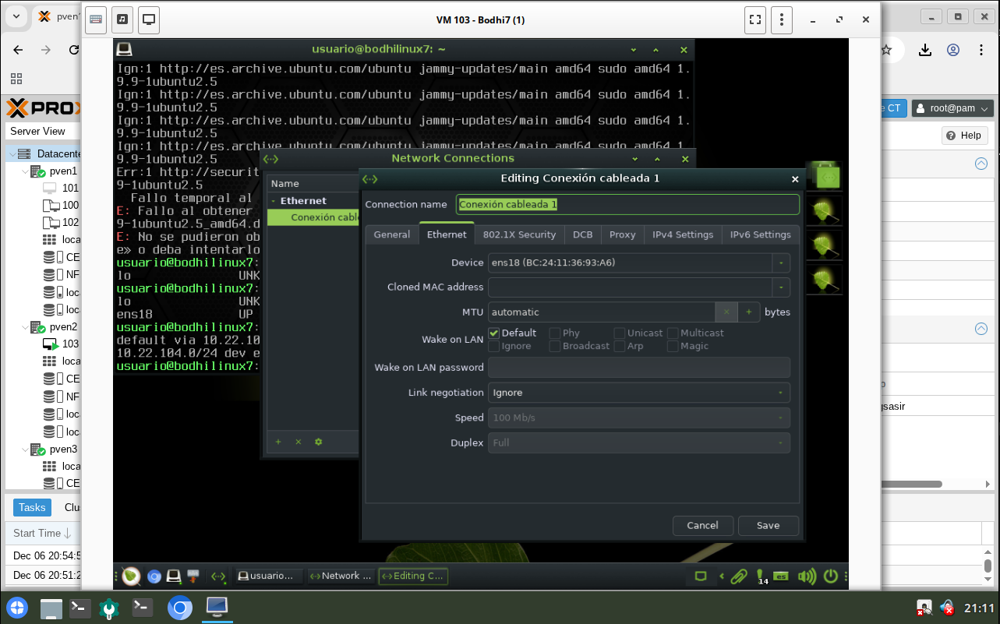

# Alta disponibilidad (HA)
Importante: La máquina destinada a la prueba de la HA debe tener como almacenamiento el CEPH o el NAS
## Creación de grupo HA
Datacenter > HA > Group > Create

## Añadir máquina al grupo HA
Datacenter > HA > Add Resources

## Opcional: Añadiendo una IP estática a la Bodhi7
Si el DHCP da problemas para la prueba de la alta disponibilidad (HA) se recomienda establecer una IP estática

