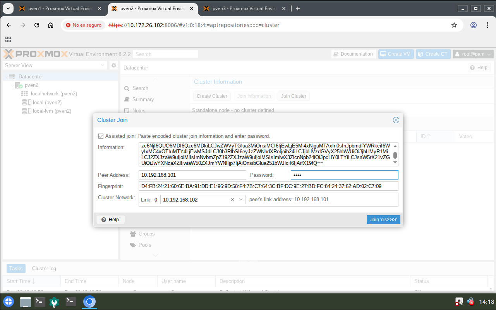
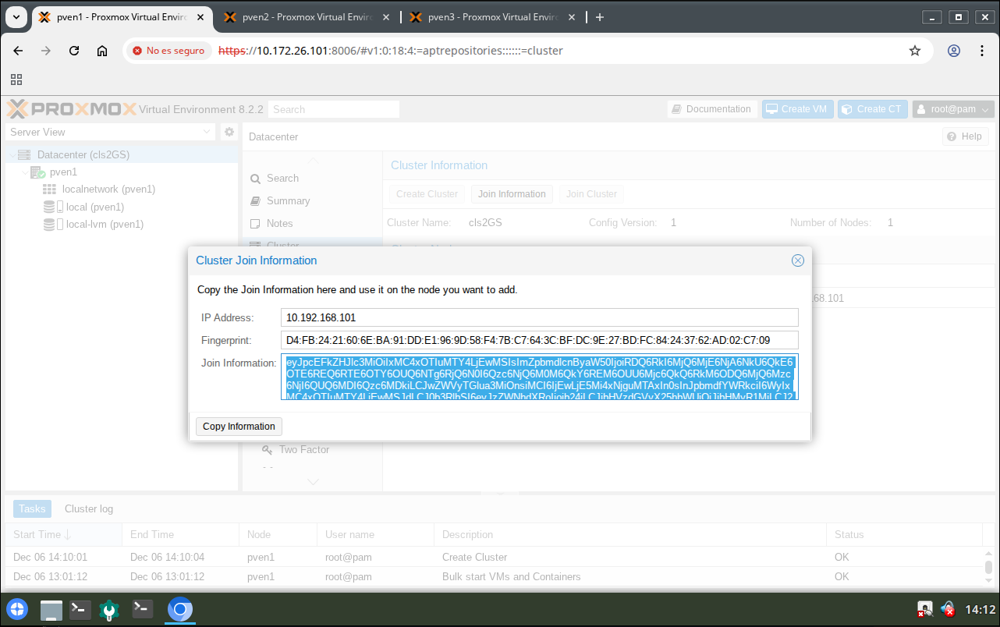
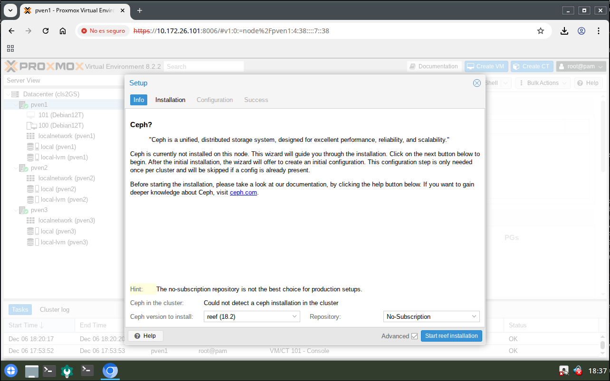
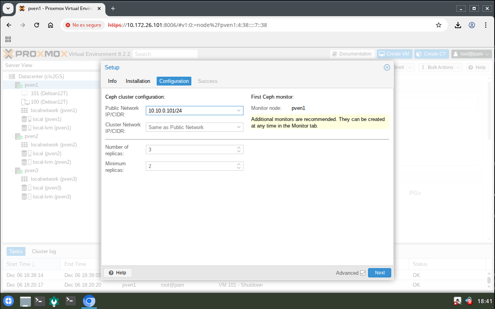
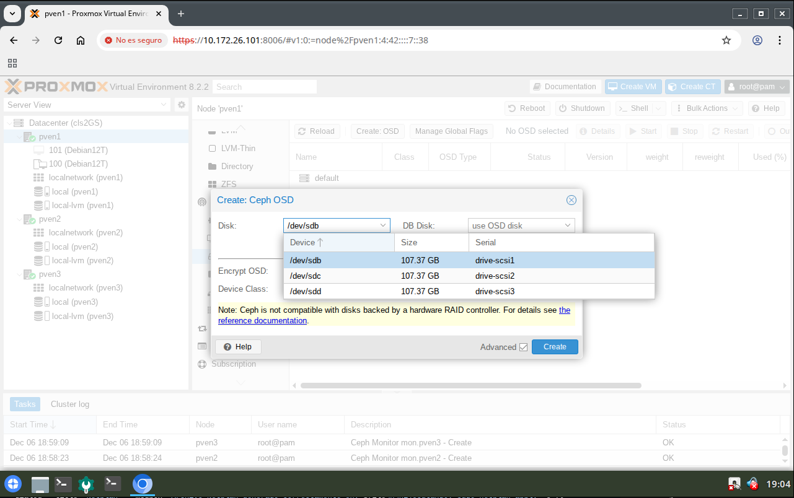

# Cluster Proxmox
## Creación del cluster
Datacenter > Cluster > Create Cluster

## Unión al cluster
Datacenter > Cluster > Join Information

Datacenter > Cluster > Join Cluster
Importante: Establecer la red interna del cluster y la contraseña del nodo del cluster

## Importación de máquinas y contenedores
### Creación del punto de montaje
Válido para cualquier nodo
#### Comprobación de puntos de montaje
```
lsblk -l
```
#### Creación de directorio para realizar el montaje
```
mkdir /media/sde1
```
#### Montaje de sde1 en local
```
mount -t auto /dev/sde1 /media/sde1/
```
### Copiado de máquinas/contenedores al almacenamiento
En el caso de usar almacenamiento local, la ruta es /var/lib/vz/dump/. Dependiento del almacenamiento destino (Directory,ZFS,...) la ruta dependerá del montaje realizado previamente
```
cp /media/sde1/BCKmvs/vzdump-qemu-103-* /var/lib/vz/dump/
```
Importante: Las máquinas/contenedores disponibles
102: Ubuntu22T  
103: Debian12T  
104: BLBeryllium  
105: Proxmox822  
106: Bodhi7  
107: Win10  
108: WinServer2022  
114: WinServer2019  
115: Win10MiniOS  
116: Ubuntu24  
117: CentOS  
## Creación del SAN CEPH
### Instalación del CEPH
Importante: Crear una red exclusiva para el CEPH
Máquina Proxmox (nodo) > Ceph > Install Ceph


### Creación de los monitores
Máquina Proxmox principal (nodo) > Ceph > Monitor > Create

### Creación de los OSD
Máquina Proxmox principal (nodo) > Ceph > OSD > Create
Importante: Realizar esta opción en cada nodo

### Creación de un Pool
Máquina Proxmox principal (nodo) > Ceph > Pool > Create

