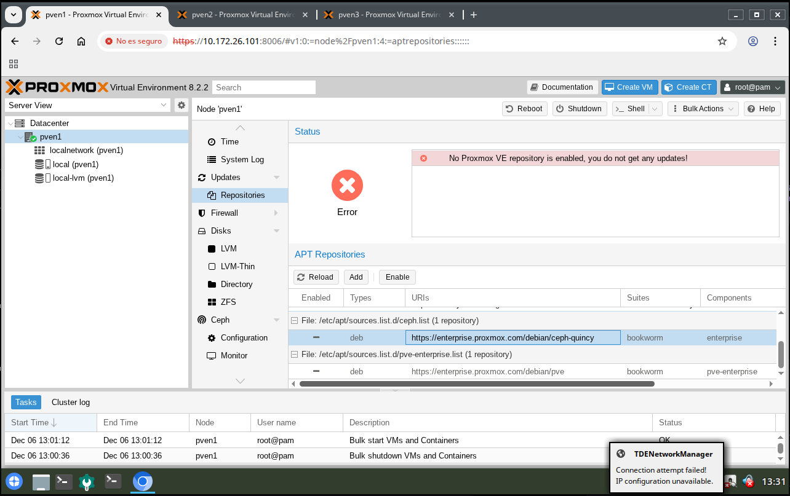

# Prerrequisitos al clúster
## Salida a internet a través del bridge
```
iface ens18 inet manual

auto vmbr0
iface vmbr0 inet dhcp
    bridge-ports ens18
    bridge-stp off
    bridge-fd 0
```
## Instalación de paquetes
```
apt install -y vim sudo dialog git
```
## Uso del script de configuración para host, hostnames y redes
[Script de configuración](https://github.com/tresespadas/sri/blob/master/script_final_v2.sh)
## Opcional: Deshabilitar repositorios
Máquina Proxmox (nodo) > Updates > Repositories

